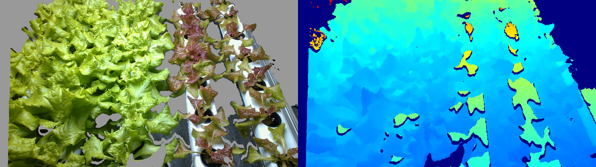
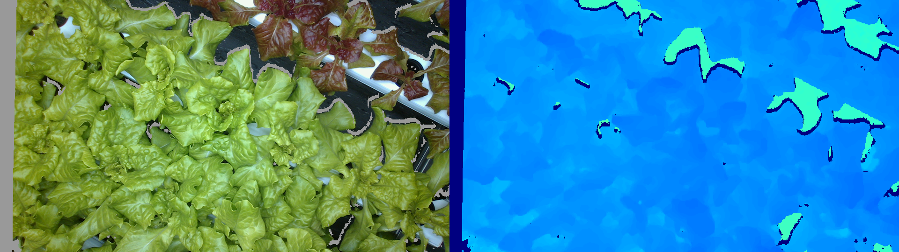
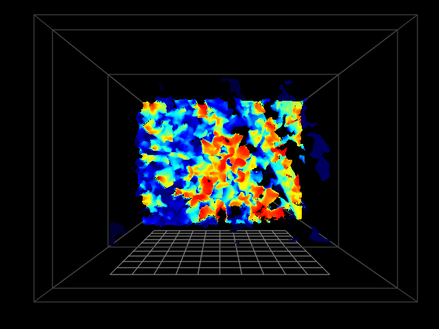
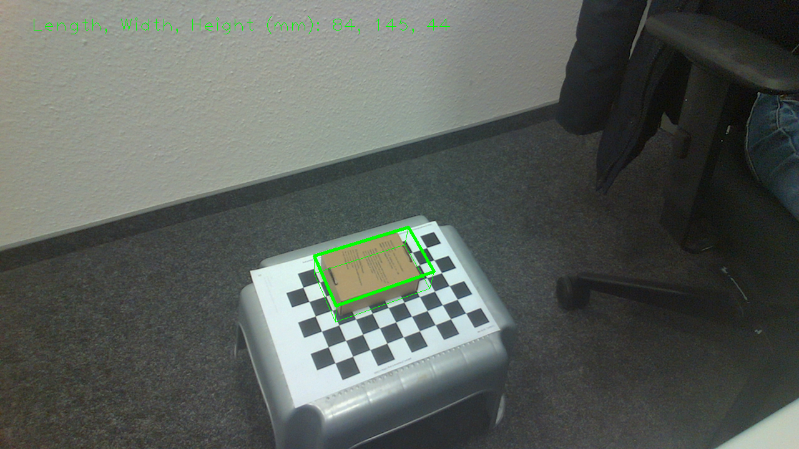

# Hack the source code of intel realsense SDK

This work is the base of Hexafarms' 3D reconstruction project using realsense cameras.

## 1. Plants with depth camera

   <figcaption align = "center"><b>Fig.1 - Depth img1</b></figcaption>
   <figcaption align = "center"><b>Fig.2 - Depth img2</b></figcaption>
   <figcaption align = "center"><b>Fig.3 - Depth img3</b></figcaption>

## 2. 3D object detection

   <figcaption align = "center"><b>Fig.4 - Box detection</b></figcaption>

